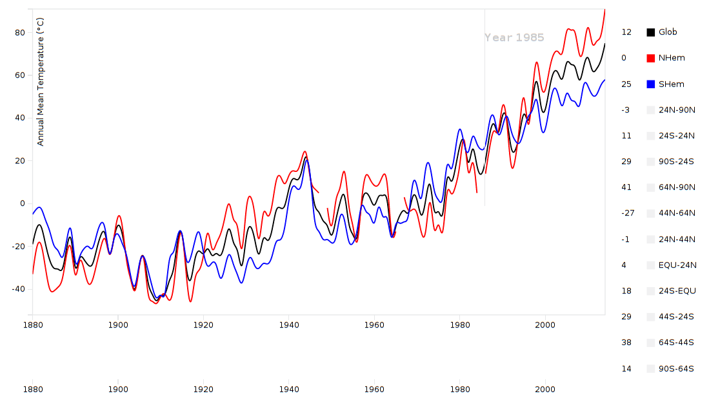
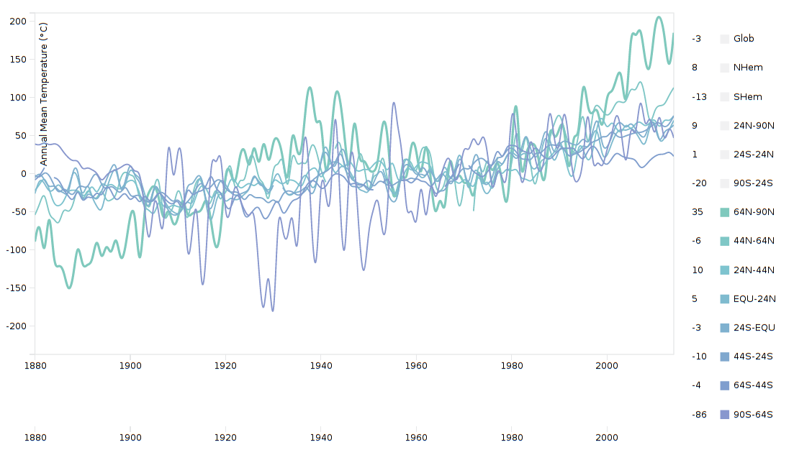
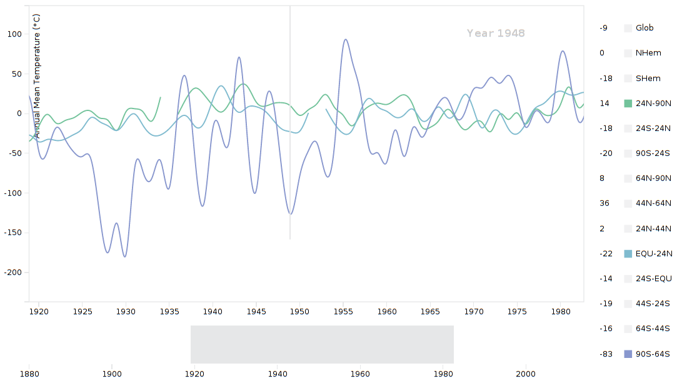
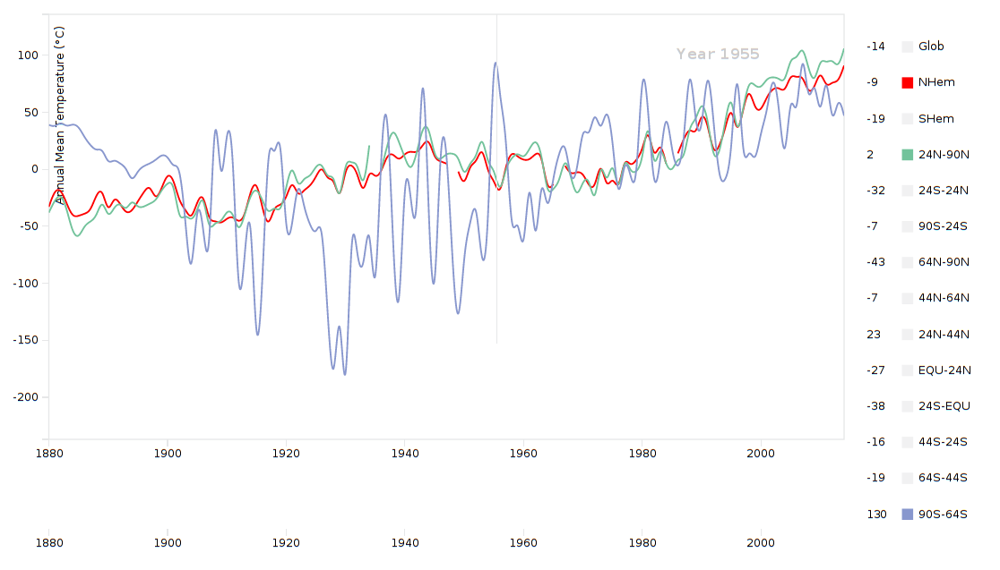

# Coursera Data Visualisation Homework

This repository contains the source codes of my homework

## Homework 1 (Week 2)
### Visualisation of "Table Data: Global and Hemispheric Monthly Means and Zonal Annual Means."

**Explanation**:

This Graph visualises the GISTEMP data for the Globe, the North and South Hemispheres, and the Zonal annual means through all the given years.

As is depicted above, the black, blue and red lines describes the Globe, the South Hemisphere, and the North Hemisphere respectively. The horizontal axis is *year*, while the vertical axis is the temperature in celsius.

And this visualisation is interactive --

1. user can hover over the main graph to know what the annual mean of the year exactly is, for all these available metrics, shown along with the legends;
2. user can select / deselect the mectrics by clicking the legends on the right, to focus on the data she is interested in;
3. user can select a portion of time by selecting an area in the small chart to the bottom of this visualisation;
4. user can hover over a legend to highlight / thicken a line of metrics.

This visualisation shows:

1. over the years, although the annual mean temperatures are viberating greatly, the overall trend is rising, especially since 1980;
2. the temperature of the North Hemisphere is usually higher than the temperature of the South;
3. regions near the poles (South and North) have higher deviation of annual mean temperatures over the years, especially between 1900 and 1960;
4. the North Pole zonal annual temperatures have risen most significantly since 1990.

